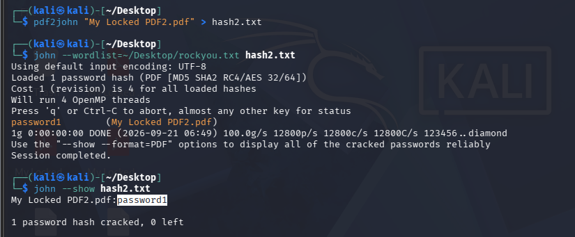
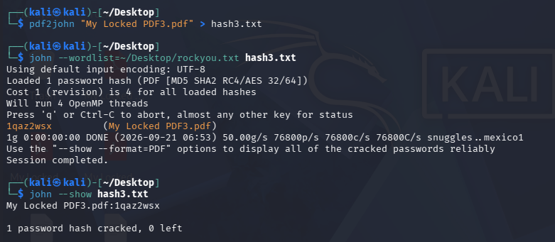
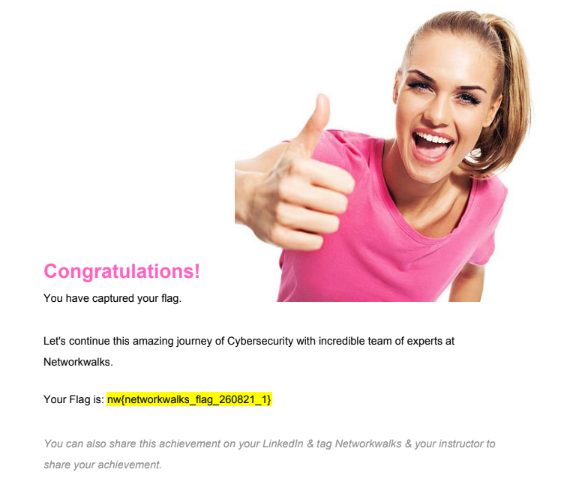

# NETWORKWALKS-ZAIN-UL-ABIDIN-B083-WK3-PM1-PASSWORD-CRACKING-JTR

**Password Cracking with JTR (John the Ripper)**

---

## 📌 Project Overview

This project focuses on using **John the Ripper (JTR)**, one of the most widely used password cracking tools, to recover the password of a protected PDF file (`My Locked PDF1.pdf`) on Kali Linux.

---

## 🎯 Objectives

- Understand what John the Ripper is and how it is used in security testing.
- Confirm John the Ripper is available on Kali Linux (comes pre-installed).
- Extract a crackable hash from the password-protected PDF file.
- Run John the Ripper against the hash to recover the password.
- Use the recovered password to open the PDF file.

---

## 🛡️ Ethical Use

This lab is intended for **educational and authorized security testing only**.

The PDF file cracked in this exercise (`My Locked PDF1.pdf`) was provided by the instructor specifically for this training exercise.

---

# 🧠 Background

John the Ripper (JTR) is a popular password cracking tool used by security professionals to test how strong passwords are. It started as a tool for Unix systems but now works on Windows, Linux, and Mac. It can check many types of password hashes and also unlock password-protected files like PDF, ZIP, and Office documents.

Johnny is the graphical version of John the Ripper, giving a simple point-and-click interface for beginners. Both tools are widely used in security testing and learning labs to understand password safety.

In this lab task, John the Ripper is used to recover the password of a protected PDF file. This exercise helps demonstrate how password cracking works and why it is important to use strong passwords for protection.

**Note:** This task was completed on Windows using John the Ripper (JTR) command-line tool together with Johnny, its graphical interface — following the original lab guide exactly.

---

# 🪜 Task & Solution

**Task:** Crack the password of the attached PDF files (`My Locked PDF1.pdf`, `My Locked PDF2.pdf`, `My Locked PDF3.pdf`) using JTR JOHN and JTR JOHNNY tools on Windows PC.

## General Solution Steps (Windows)

1. Download **John the Ripper** from the official website:
   `https://www.openwall.com/john/`

2. Download **Johnny** (the GUI for John the Ripper):
   `https://openwall.info/wiki/john/johnny`

3. Run the Johnny setup file and complete the installation.

4. Open Johnny after installation.

5. Click on **Settings**, then **Browse**, and select **john.exe** — this file is located in the **run** folder of the John the Ripper installation.

6. For each locked PDF file, repeat the following:
   - Open the online hash extractor tool: `https://www.onlinehashcrack.com/tools-pdf-hash-extractor.php`
   - Browse to the PDF file and click **Upload**.
   - Select and copy the generated hash value.
     *Note: If the hash contains extra characters like `b'` at the start, remove them when saving — the hash value should be in the format starting with `$pdf$....`*
   - Open **Notepad**, paste the hash value, and save the file (e.g. `hash1.txt`, `hash2.txt`, `hash3.txt`).
   - Open **Johnny**, click **"Open password file"**, browse to the saved hash file, and click **Open**.
   - Click **"Start new attack"**.
   - Wait for Johnny to crack the password (time depends on computer speed and password complexity).
   - Use the recovered password to open the corresponding encrypted PDF and confirm it opens successfully.

---

## PDF 1 — My Locked PDF1.pdf

### Screenshot

### 🏁 Flag Captured

**Flag1:** `nw{cybersecurity_flag_captured_2608}`

---

## PDF 2 — My Locked PDF2.pdf

### Screenshot

### 🏁 Flag Captured

**Flag2:** *(nw{networkwalks_persistence_jtr_270521})*

---

## PDF 3 — My Locked PDF3.pdf

### Screenshot

### 🏁 Flag Captured

**Flag3:** *(nw{networkwalks_flag_260821_1})*

---

# 💡 Extra References & Tips

Encryption is a two-way function — what is encrypted can be decrypted with the proper key. Hashing, however, is a one-way function that scrambles plain text to produce a unique message digest.

### Did You Know? — Real-World African Cybersecurity Incidents
- **2026 — South Africa:** MTN Group's 2025 breach escalated in 2026, with over 5,700 customers affected in Ghana alone and criminal investigations opened across multiple countries.
- **2025 — Namibia:** Telecom Namibia refused to pay a ransom; attackers leaked billing data of senior government officials, exposing personal records of thousands of subscribers.
- **2025 — Senegal:** The national tax authority suffered a ransomware attack threatening to erase and leak fiscal records covering millions of citizens and businesses.
- **2024 — Uganda:** Hackers broke into the Bank of Uganda and stole $16.8 million — one of Africa's largest-ever banking cyber heists.
- **2024 — Nigeria:** Fintech giant Flutterwave was hacked, with approximately $7 million silently diverted from customer accounts.
- **2024 — South Africa:** Cell C's breach exposed 2TB of data from 7.7 million customers, including ID numbers and banking details.
- **2024 — Kenya:** The Urban Roads Authority (KURA) suffered a major data breach exposing sensitive government infrastructure data.
- **2024 — Cameroon:** National electricity provider ENEO was cyberattacked, suspending power management applications nationwide.

---

# 💡 Why Password Cracking Matters

Password cracking tools like John the Ripper show exactly how vulnerable weak passwords are once an attacker has access to a password hash — whether from a stolen file, a leaked database, or an intercepted authentication exchange. A weak or common password can be recovered in seconds using a wordlist attack, while a strong, unique password can take impractically long to crack. This is why organizations enforce strong password policies, use salted hashing, and monitor for leaked credentials.

---

# 💡 What I Learned

### 1. How Password Cracking Tools Work
I learned how John the Ripper takes a password hash and systematically tests candidate passwords from a wordlist until a match is found.

### 2. Extracting Hashes from Protected Files
I learned how a tool like `pdf2john` can convert a password-protected PDF into a crackable hash format that John the Ripper can process.

### 3. Wordlist-Based Attacks
I learned how using a large, well-known wordlist (like rockyou.txt) significantly increases the chance of cracking a weak or common password.

### 4. Encryption vs Hashing
I learned the key difference between encryption (reversible with the right key) and hashing (a one-way function), and why this distinction matters for password security.

### 5. Real-World Impact
I learned how weak password practices have contributed to real, large-scale breaches across African organizations and governments in recent years.

---

# 🔐 Security & Ethical Use

This lab is created for learning and cybersecurity practice.

The file cracked in this exercise was provided directly by the instructor for this authorized training lab.

---

# 🔗 Tools & Resources

- **John the Ripper (official):** https://www.openwall.com/john/
- **Johnny GUI (official):** https://openwall.info/wiki/john/johnny
- **Online PDF Hash Extractor (reference tool used in original guide):** https://www.onlinehashcrack.com/tools-pdf-hash-extractor.php

---

# 👤 Author

**Zain ul Abidin**

**Cyber Security Student B083**

---

## 📌 Project Information

**Program Name:** Cybersecurity at Networkwalks
**Week:** 03
**Project Module:** PM1 — Password Cracking with JTR
**Author:** Zain ul Abidin
**B-Number:** B083
**Repository:** GitHub
