# NETWORKWALKS-ZAIN-UL-ABIDIN-B083-WK3-PM2-PASSWORD-CRACKING-NW-TOOLS

**Password Cracking with Networkwalks Tools**

---

## 📌 Project Overview

This project focuses on using two free, browser-based tools built by Networkwalks — the **Hash Calculator** and the **Password Cracker** — to extract a crackable hash from a password-protected PDF and recover its password through a dictionary attack, without installing any software.

---

## 🎯 Objectives

- Understand what password cracking is and why weak passwords are risky.
- Understand how a locked file's password is stored as a hash.
- Use the Networkwalks Hash Calculator to extract a crackable hash from `My Locked PDF1.pdf`.
- Use the Networkwalks Password Cracker to recover the plaintext password from that hash.
- Use the recovered password to open the PDF file.

---

## 🛡️ Ethical Use

This lab is intended for **educational and authorized security testing only**.

The PDF file cracked in this exercise (`My Locked PDF1.pdf`) was provided by the instructor specifically for this training exercise.

---

# 🧠 Background

Password cracking is the process of recovering a password from stored data or a protected file. Security professionals use it to test how strong a password is and to show why weak passwords are risky. If a password is short or common, it can be found quickly, which proves the need for strong passwords.

Many files like PDF, ZIP, and Office documents can be locked with a password. When a file is locked, its password is stored in the form of a hash. A hash is a scrambled value that represents the password. To recover the password, the hash is first extracted from the file, then run through a cracking tool that tries different words until it finds a match.

This lab uses two free online tools made by Networkwalks. First, the **Hash Calculator** is used to extract the hash from a locked PDF file. Then, the **Password Cracker** is used to find the real password from that hash. Both tools run entirely in the web browser, so no installation is needed.

---

# 🪜 Task & Solution

**Task:** Crack the password of the attached PDF file (`My Locked PDF1.pdf`) using the Networkwalks Hash Calculator and Password Cracker tools on Windows.

## Solution Steps

### STEP 1 — Download the Encrypted PDF
Download the encrypted PDF file (`My Locked PDF1.pdf`) from the lab page:
`https://networkwalks.com/project-task-lab-password-cracking-with-networkwalks-tools/`

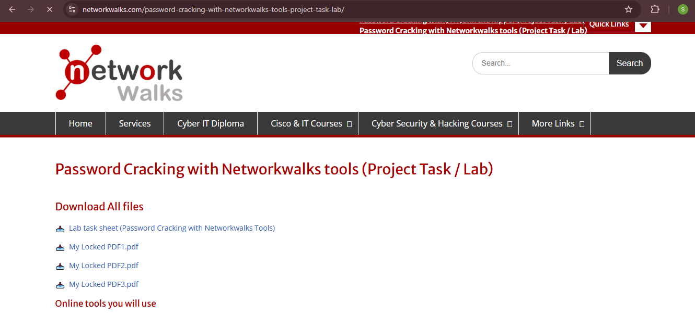

---

### STEP 2 — Open the Hash Calculator
Open the **Networkwalks Hash Calculator** in the web browser:
`https://networkwalks.com/hash-calculator/`

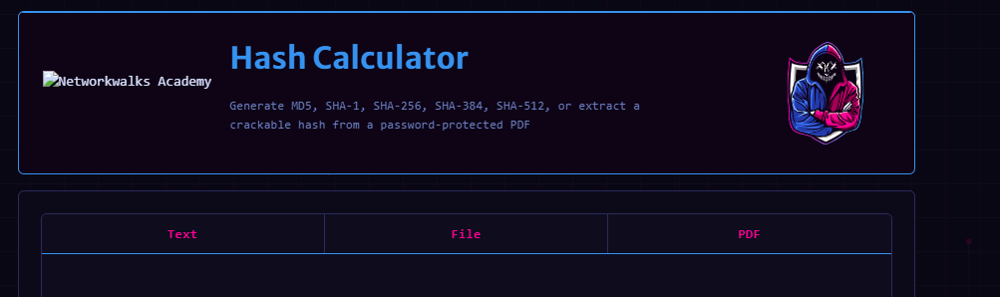

---

### STEP 3 — Upload the Locked PDF
Upload the locked PDF file to the Hash Calculator. The tool reads the file and returns a crackable hash value starting with `$pdf$...`.

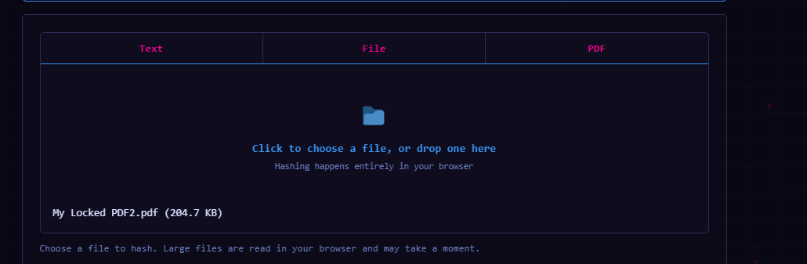

---

### STEP 4 — Copy the Full Hash Value
Copy the **full** hash value.
*Note: Make sure to copy the complete hash starting from `$pdf$` — do not miss any part of it.*

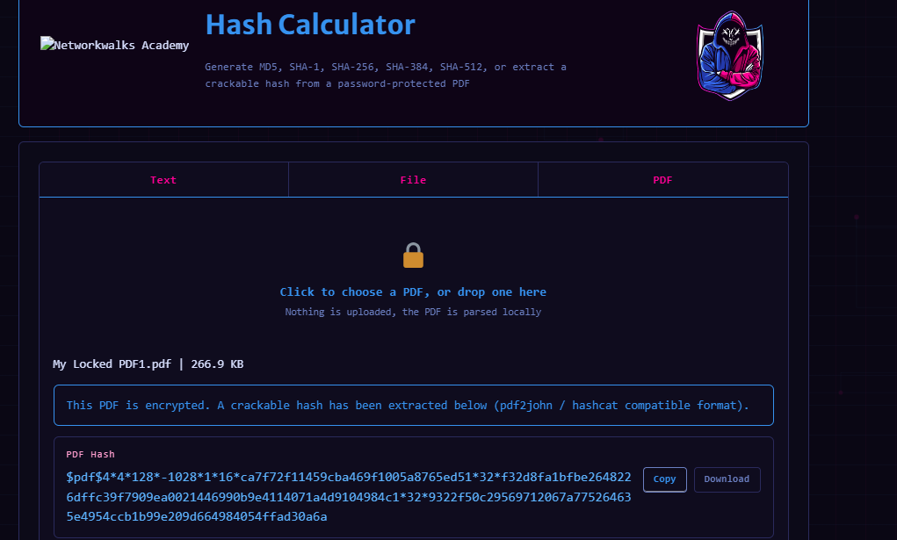

---

### STEP 5 — Open the Password Cracker
Open the **Networkwalks Password Cracker** in the web browser:
`https://networkwalks.com/password-cracker/`

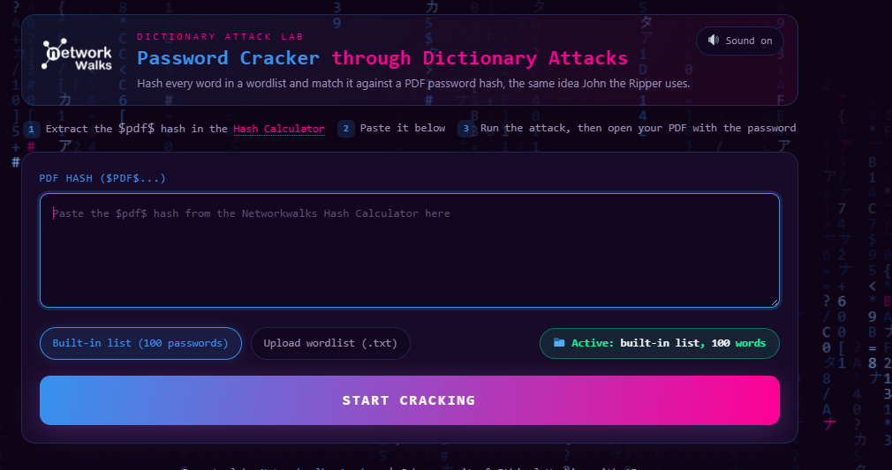

---

### STEP 6 — Paste the Hash and Start the Attack
Paste the hash value into the Password Cracker and click **Start Cracking**. The tool runs a dictionary attack, trying different words from a wordlist until it finds a match.

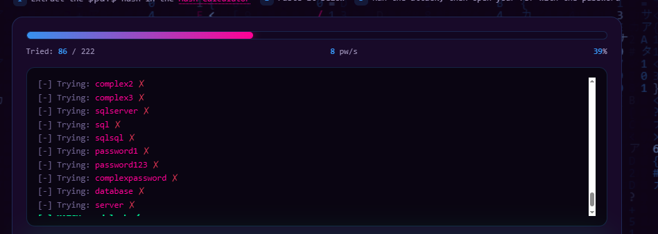

---

### STEP 7 — Wait for the Cracked Password
Wait for the tool to finish. The cracked password is displayed on screen once a match is found.
*Note: The time taken depends on how simple or complex the password is.*

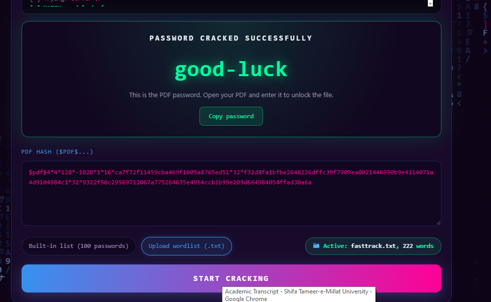

---

### STEP 8 — Open the PDF with the Cracked Password
Open the locked PDF file and enter the cracked password to unlock it.

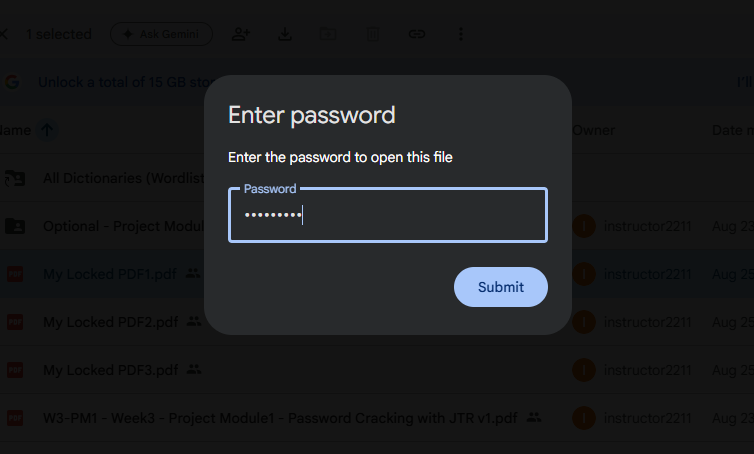

---

### STEP 9 — PDF Opens Successfully
The PDF file opens successfully — lab complete.

---

## Repeating the Process for PDF 2 and PDF 3

The same Hash Calculator → Password Cracker process (Steps 1–9 above) was repeated for `My Locked PDF2.pdf` and `My Locked PDF3.pdf`.

### My Locked PDF2.pdf

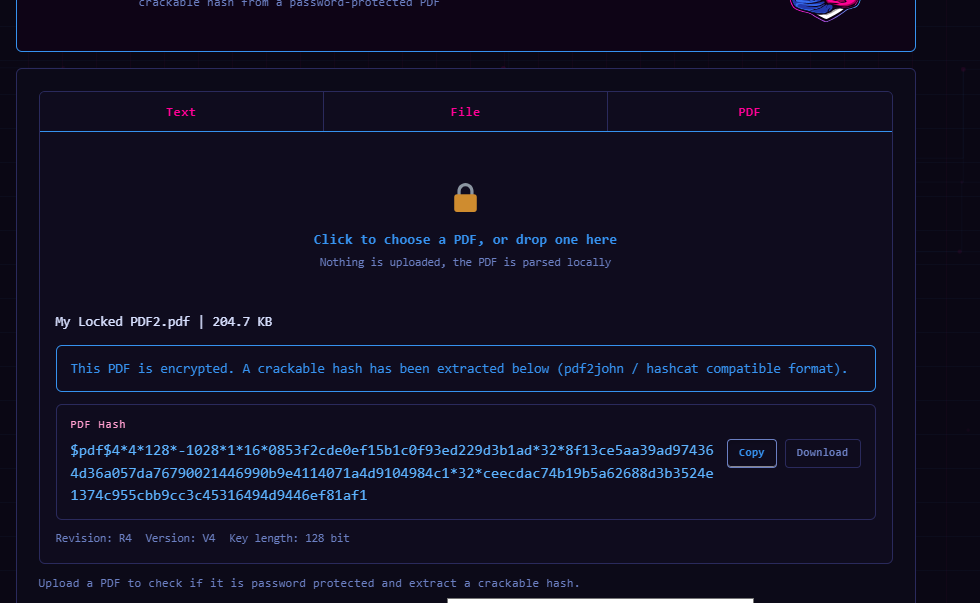
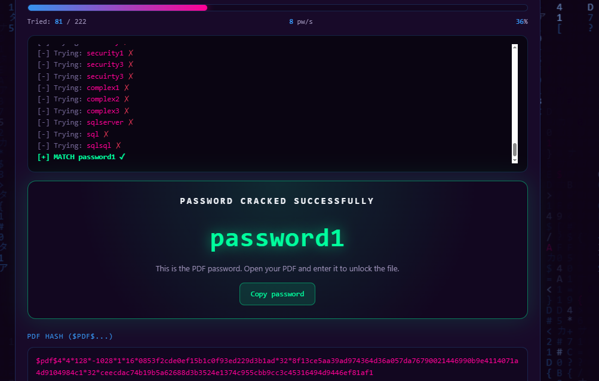
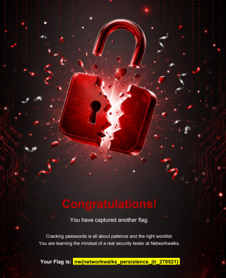

**Cracked Password (PDF2):** *(add once cracked)*

---

### My Locked PDF3.pdf

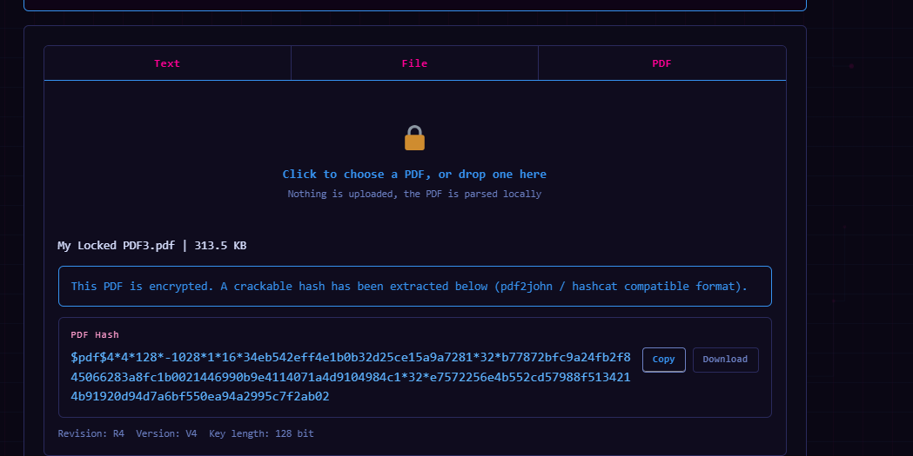
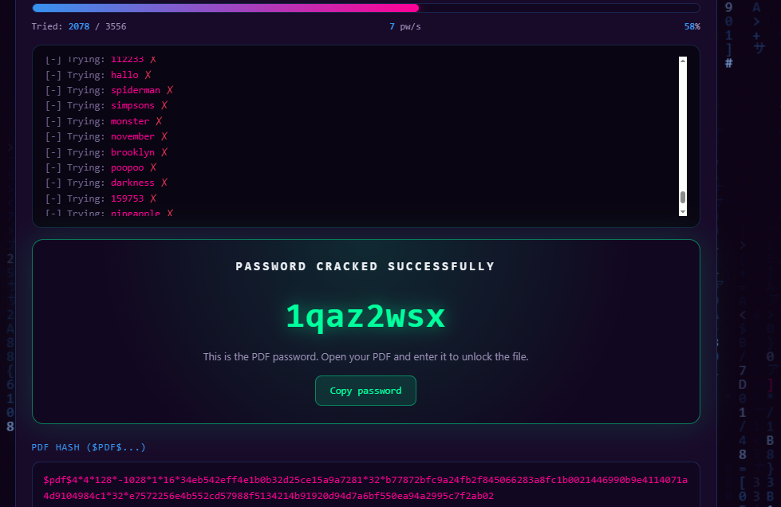

**Cracked Password (PDF3):** *(add once cracked)*

---

## 📋 Summary — All Three Passwords

| PDF File | Cracked Password |
|---|---|
| My Locked PDF1.pdf | *good-luck* |
| My Locked PDF2.pdf | *Password1* |
| My Locked PDF3.pdf | *1qazwsx* |

---

## 🏁 Flag Captured

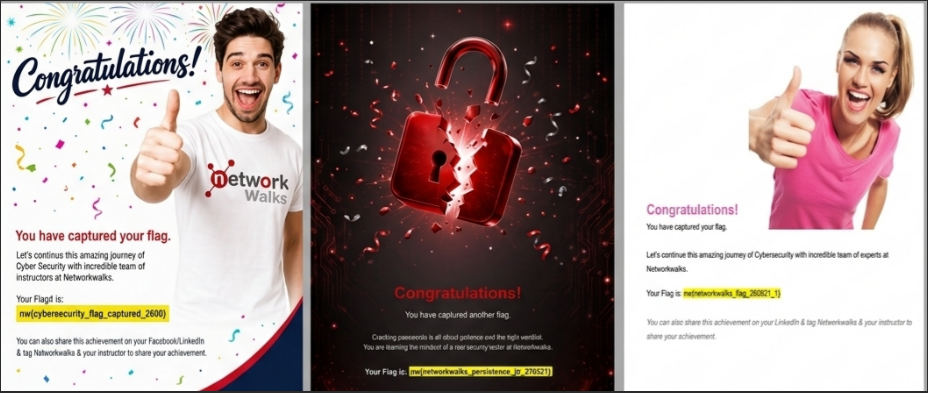

**Flag1:** *(add flag text once captured)*

---

# 💡 Extra References & Tips

Encryption is a two-way function — what is encrypted can be decrypted with the proper key. Hashing, however, is a one-way function that scrambles plain text to produce a unique message digest.

### Do You Know?
- A simple 8-character password using only lowercase letters can be cracked in minutes, while a strong 12-character mixed password can take many years.
- Over 24 billion username and password pairs are available on the dark web from past breaches.
- "123456" and "password" are still among the most used passwords in the world every year.
- **2025 — Global:** A leak of around 183 million Gmail login details showed how old stolen passwords keep circulating for years.

---

# 💡 Why Password Cracking Matters

This lab demonstrates the exact same principle as John the Ripper (PM1), but through purpose-built web tools instead of a desktop application. It reinforces that password cracking isn't limited to specialist software — with a hash and a wordlist, a simple browser-based tool can recover a weak password just as effectively. This is why strong, unique passwords and modern salted-hashing practices matter far more than which specific cracking tool an attacker might use.

---

# 💡 What I Learned

### 1. Browser-Based Security Tools
I learned that password cracking doesn't always require installed software — the same hash extraction and dictionary attack process can be done entirely through the browser.

### 2. Hash Extraction from Protected Files
I learned how the Hash Calculator reads a locked PDF and produces a crackable hash (`$pdf$...`) without ever uploading the file's actual content externally, since hashing runs locally in the browser.

### 3. Dictionary Attacks
I learned how a Password Cracker systematically tries every word in a wordlist against the hash until a match is found — the same underlying idea as John the Ripper's wordlist mode.

### 4. Real-World Password Statistics
I learned just how widespread weak and reused passwords are, and how billions of leaked credentials continue to circulate and get reused in new attacks years later.

### 5. Documentation
I learned how to properly record the tool-based cracking process with screenshots for a professional report.

---

# 🔐 Security & Ethical Use

This lab is created for learning and cybersecurity practice.

The file cracked in this exercise was provided directly by the instructor for this authorized training lab.

---

# 🔗 Tools & Resources

- **Networkwalks Hash Calculator:** https://networkwalks.com/hash-calculator/
- **Networkwalks Password Cracker:** https://networkwalks.com/password-cracker/
- **Lab Page:** https://networkwalks.com/project-task-lab-password-cracking-with-networkwalks-tools/

---

# 👤 Author

**Zain ul Abidin**

**Cyber Security Student B083**

---

## 📌 Project Information

**Program Name:** Cybersecurity at Networkwalks
**Week:** 03
**Project Module:** PM2 — Password Cracking with Networkwalks Tools
**Author:** Zain ul Abidin
**B-Number:** B083
**Repository:** GitHub
